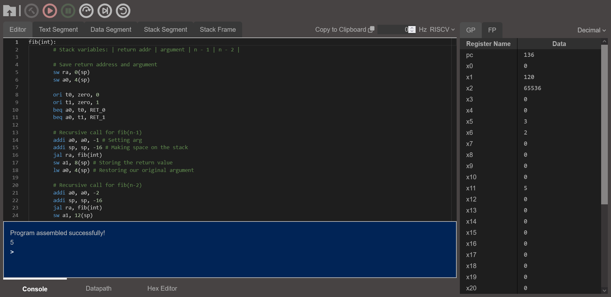

# SWIM (Simple Web Interface for eMulation)

This was originally developed by Kevin Cahalan, Jerrett Longworth, Huy Nguyen, Evan Raiford, and Jimmie Smith at UCF as a senior design project. Version 2 was developed by Ryan Harding, Cay Henning, Cameron McDougal, and Brooks McKinley as their senior design project.



A web-based emulator for MIPS64/RISC-V made for educational purposes. The user interface that provides the following features:

- Step execute and execute code down to the individual [stages](https://en.wikipedia.org/wiki/Instruction_cycle)
- Execution speed control and breakpoints
- Upload files to SWIM and Copy code to the user's clipboard to be saved locally
- A register viewer that displays General Purpose and Floating Point registers with toggling to different views (decimal, binary, hexadecimal, float, double)
  - A register editor that allows changing the values of registers while a program is executing
- A console viewer to display errors and suggestions on fixing them
  - Syscalls and IO to interact with the program through the console when running
- A memory viewer to see the code compiled and updated as it executes
  - A hex editor for the memory to change memory while a program executes
- Text/data segment viewer for viewing assembled code in memory
- Stack frame and stack segment viewer for tracking function calls in a program while it executes
- A visualization of the datapath to see the individual parts that make up the general and floating-point coprocessors and the values inside each wire
- Utilizes the [Monaco Editor](https://microsoft.github.io/monaco-editor/) code library to provide:
	- Syntax highlighting of our custom language
	- Highlighting the previously executed line
	- Providing mouse hover information on instructions and errors
	- Expands the pseudo-instructions into their hardware equivalent upon assembling code

All of this wholly developed with the [Rust](https://www.rust-lang.org/) language with the interface built with the [Yew](https://yew.rs/) framework which uses [WebAssembly](https://webassembly.org/) and JavaScript to house the emulation core and parser/assembler.

## MIPS Support

The following instructions are supported on the MIPS emulator core:

- Conventional Instructions:
	- add
	- addi
	- addiu
	- addu
	- and
	- andi
	- aui
	- b
	- beq
	- bne
	- dadd
	- daddi
	- daddiu
	- daddu
	- dahi
	- dati
	- ddiv
	- ddivu
	- div
	- dmul
	- dmulu
	- dsub
	- dsubu
	- j
	- jal
	- jalr
	- jr
	- lui
	- lw
	- mul
	- nop
	- or
	- ori
	- sll
	- slt
	- sltu
	- sub
	- sw
	- syscall `Note: This is currently a stubbed instruction to halt emulation.`

- Floating-Point Instructions:
	- add.d
	- add.s
	- bc1f
	- bc1t
	- c.eq.d
	- c.eq.s
	- c.le.d
	- c.le.s
	- c.lt.d
	- c.lt.s
	- c.nge.d
	- c.nge.s
	- c.ngt.d
	- c.ngt.s
	- div.d
	- div.s
	- dmfc1
	- dmtc1
	- lwc1
	- mfc1
	- mtc1
	- mul.d
	- mul.s
	- sub.d
	- sub.s
	- swc1

- Pseudo-instructions:
	- ddivi
	- ddiviu
	- divi
	- dmuli
	- dmuliu
	- dsubi
	- dsubiu
	- li
	- lw `(followed by a label)`
	- move
	- muli
	- seq
	- sge
	- sgeu
	- sgt
	- sgtu
	- sle
	- sleu
	- sne
	- subi
	- sw `(followed by a label)`

## RISC-V Support

The RISC-V core supports the RV32I, RV64I, RV32M, RV64M, RV32F, and RV64F extensions. The following instructions are supported in the RISC-V core:

- RV32I:
    - lui
    - auipc
    - addi
    - slti
    - xori
    - ori
    - andi
    - slli
    - srli
    - srai
    - add
    - sub
    - sll
    - slt
    - sltu
    - cor
    - srl
    - sra
    - or
    - and
    - fence
    - fence.i
    - csrrw
    - csrrs
    - csrrc
    - csrrwi
    - csrrsi
    - csrrci
    - ecall
    - ebreak
    - uret
    - sret
    - mret
    - wfi
    - sfence.vma
    - lb
    - lh
    - lw
    - lbu
    - lhu
    - sb
    - sh
    - sw
    - jal
    - jalr
    - beq
    - bne
    - blt
    - bge
    - bltu
    - bgeu
- RV64I:
    - addiw
    - slliw
    - srliw
    - addw
    - subw
    - sllw
    - srlw
    - sraw
    - lwu
    - ld
    - sd
- RV32M:
    - mul
    - mulh
    - mulhsu
    - mulhu
    - div
    - divu
    - rem
    - remu
- RV64M:
    - mulw
    - divw
    - divuw
    - remw
    - remuw
- RV32F:
    - fmadd.s
    - fmsub.s
    - fnmsub.s
    - fnmadd.s
    - fadd.s
    - fsub.s
    - fmul.s
    - fdiv.s
    - fsqrt.s
    - fsgnj.s
    - fsgnjn.s
    - fsgnjx.s
    - fmin.s
    - fmax.s
    - fcvt.w.s
    - fcvt.wu.s
    - fmv.x.w
    - feq.s
    - flt.s
    - fle.s
    - fclass.s
    - fcvt.s.w
    - fcvt.s.wu
    - fmv.w.x
    - fmadd.d
    - fmsub.d
    - fnmadd.d
    - fnmsub.d
    - fadd.d
    - fsub.d
    - fmul.d
    - fdiv.d
    - fsqrt.d
    - fsgnj.d
    - fsgnjn.d
    - fsgnjx.d
    - fmin.d
    - fmax.d
    - fcvt.s.d
    - fcvt.d.s
    - feq.d
    - flt.d
    - fle.d
    - fclass.d
    - fcvt.w.d
    - fcvt.wu.d
    - fcvt.d.w
    - fcvt.d.wu
    - flw
    - fsw
    - fld
    - fsd
- RV64F:
    - fcvt.l.s
    - fcvt.lu.s
    - fcvt.s.l
    - fcvt.s.lu
- Pseudo-instructions:
    - li
    - call
    - tail
    - mv
    - not
    - neg
    - negw
    - sext.w
    - seqz
    - snez
    - sltz
    - sgtz
    - beqz
    - bnez
    - blez
    - bgez
    - bltz
    - bgtz
    - bgt
    - ble
    - bgtu
    - bleu
    - j
    - jr
    - jalr
    - ret
    - fmv.s
    - fabs.s
    - fneg.s

## Data Directives

The following directives are supported in the .data segment:

- .ascii
- .asciiz
- .byte
- .double
- .float
- .half
- .space
- .word

## System Calls and IO

SWIM supports IO through the console. Upon executing the `syscall` instruction in MIPS or the `ecall` instruction in RISC-V, SWIM will attempt to perform a syscall based on the values of the argument registers.

In both MIPS and RISC-V, the call number is extracted from the `a0` register, and the integer/memory address argument are extracted from the `a1` register. For floating point arguments, the value is extracted from the `f0` register for MIPS and `f10` for RISC-V.

For return values, in MIPS, the return value for a syscall is placed in the `v0` register while in RISC-V it's placed in the `a1` register. For floating point return values, the result is returned to `f0` for MIPS and `f10` for RISC-V.

The following table shows a list of the supported syscalls and their arguments.

| Name         | Description                                                                                                                                                            | Call Number | Argument Type  | Return Type |
|--------------|------------------------------------------------------------------------------------------------------------------------------------------------------------------------|-------------|----------------|-------------|
| exit         | Halts the emulator core                                                                                                                                                | 0           | None           | None        |
| print_int    | Prints the integer value in the argument register                                                                                                                      | 1           | Integer        | None        |
| print_float  | Prints the float value in the argument register                                                                                                                        | 2           | Float          | None        |
| print_double | Prints the double value in the argument register                                                                                                                       | 3           | Double         | None        |
| print_string | Prints a string to console, starting at the memory address in the register and ending at a null byte                                                                   | 4           | Memory Address | None        |
| read_int     | Reads the next int from the console and stores it in the argument register                                                                                             | 5           | None           | Integer     |
| read_float   | Reads the next float from the console and stores it in the argument register                                                                                           | 6           | None           | Float       |
| read_double  | Reads the next double from the console and stores it in the argument register                                                                                          | 7           | None           | Double      |
| read_string  | Reads from the console until a newline character is encountered and stores it in the provided memory address with a null terminator. Returns the number of bytes read. | 8           | Memory Address | Integer     |

Each of the syscall names are also pseudo-instructions that translate into the instructions to set the `a0` register to the correct value and perform the syscall instruction.

As an example, the following RISC-V assembly reads an integer typed by the user, doubles it, and then prints it out.

```
read_int
add a1, a1, a1
print_int
exit
```

## Compiling

While SWIM is currently being hosted [here](https://swim-ucf.github.io/SWIM/), you can compile and run it locally on your browser as long as it supports WebAssembly.

1. Install the latest stable rust toolchain with `rustup` at https://www.rust-lang.org/tools/install
	- If you plan on compiling the source yourself, make sure to add WebAssembly as a compile target by typing `rustup target add wasm32-unknown-unknown` in your terminal
2. Install [trunk](https://trunkrs.dev/#install)
3. `git clone` the repository or download the source [here](https://github.com/SWIM-ucf/SWIM/releases)
4. When you are in the root directory of the project, type `trunk serve --open` in your terminal to load it locally

## Licensing

SWIM is licensed under GNU's GPL-3.0 as shown [here](LICENSE)
